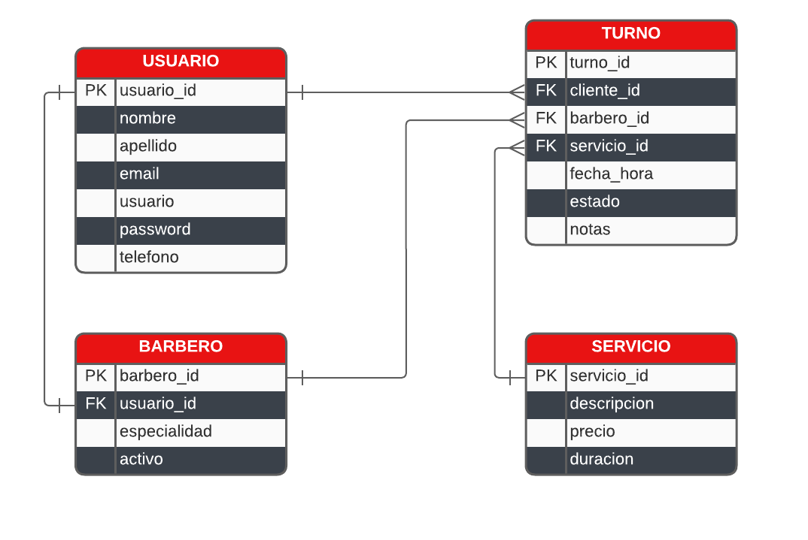
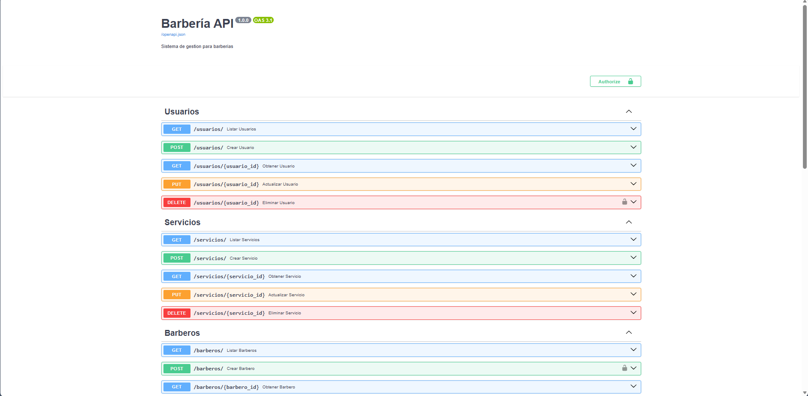
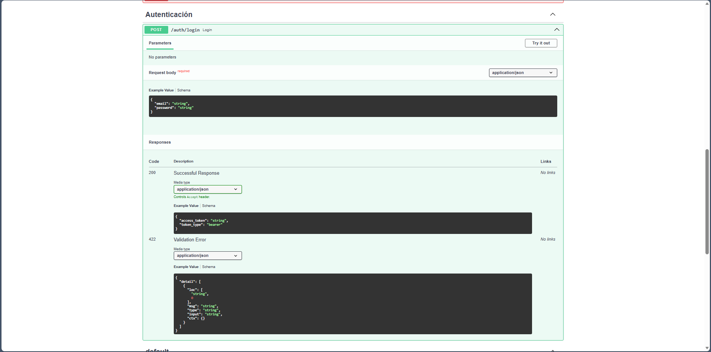
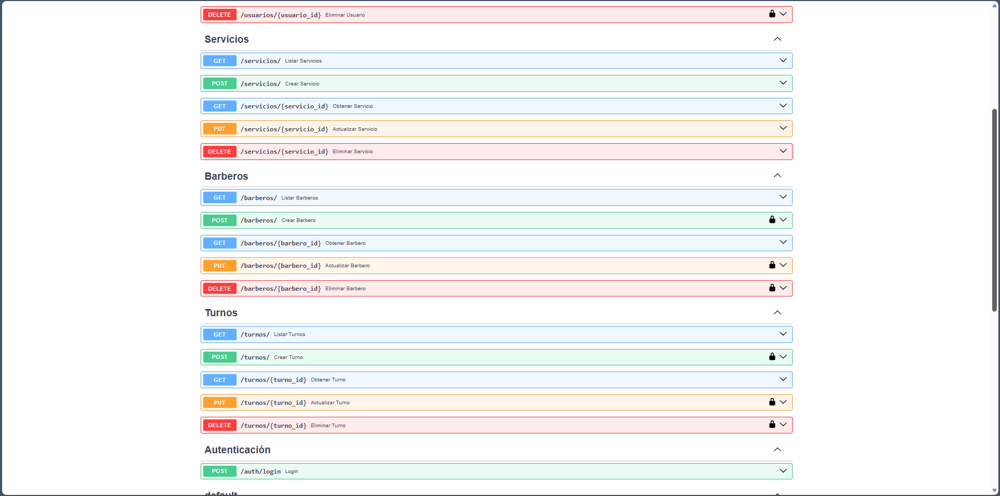

# Barbería API

Sistema backend completo para gestión de barberías desarrollado con FastAPI, PostgreSQL y Docker.


## Descripción

API REST que permite la gestión integral de una barbería, incluyendo usuarios, barberos, servicios y sistema de reservas de turnos con validaciones avanzadas.

### Características principales

- **CRUD completo** de usuarios, barberos, servicios y turnos
- **Autenticación JWT** con contraseñas hasheadas (bcrypt)
- **Endpoints protegidos** con sistema de autorización
- **Validaciones de negocio**: turnos solapados, fechas pasadas, disponibilidad
- **Tests automatizados** con pytest
- **Completamente dockerizado** (production ready)
- **Documentación automática** con Swagger/OpenAPI

---

## Arquitectura

### Stack Tecnológico

- **Backend**: FastAPI
- **Base de datos**: PostgreSQL 16
- **ORM**: SQLAlchemy
- **Validación**: Pydantic
- **Autenticación**: JWT (python-jose)
- **Testing**: pytest
- **Containerización**: Docker + Docker Compose

### Modelo de Datos



**Entidades:**
- **Usuario**: Clientes y datos de autenticación
- **Barbero**: Especialistas vinculados a usuarios
- **Servicio**: Catálogo de servicios con precios y duraciones
- **Turno**: Reservas con validaciones de disponibilidad

---

## Instalación y Uso

### Prerequisitos

- Docker Desktop instalado
- Git

### Opción 1: Con Docker (Recomendado)

```bash
# Clonar repositorio
git clone https://github.com/matufalcon/gestion-barberia.git
cd gestion-barberia

# Levantar containers
docker-compose up

# La API estará disponible en http://localhost:8000
# Documentación en http://localhost:8000/docs
```

### Opción 2: Instalación local

```bash
# Clonar repositorio
git clone https://github.com/TU_USUARIO/gestion-barberia.git
cd gestion-barberia

# Crear entorno virtual
python -m venv venv
source venv/bin/activate  # Windows: venv\Scripts\activate

# Instalar dependencias
pip install -r requirements.txt

# Configurar variables de entorno
cp .env.example .env
# Editar .env con tus credenciales de PostgreSQL

# Crear tablas
python -m src.models.crear_tablas

# Ejecutar
uvicorn src.main:app --reload
```

---

## Documentación de la API

### Swagger UI

Una vez la aplicación esté corriendo, visitá:

**http://localhost:8000/docs**



### Endpoints principales

#### Autenticación
- `POST /auth/login` - Iniciar sesión y obtener token JWT



#### Usuarios
- `POST /usuarios/` - Registrar nuevo usuario (público)
- `GET /usuarios/` - Listar usuarios
- `GET /usuarios/{id}` - Obtener usuario específico
- `PUT /usuarios/{id}` - Actualizar usuario
- `DELETE /usuarios/{id}` - Eliminar usuario 🔒

#### Servicios
- `POST /servicios/` - Crear servicio 🔒
- `GET /servicios/` - Listar servicios
- `GET /servicios/{id}` - Obtener servicio
- `PUT /servicios/{id}` - Actualizar servicio 🔒
- `DELETE /servicios/{id}` - Eliminar servicio 🔒

#### Barberos
- `POST /barberos/` - Crear barbero 🔒
- `GET /barberos/` - Listar barberos
- `GET /barberos/{id}` - Obtener barbero
- `PUT /barberos/{id}` - Actualizar barbero 🔒
- `DELETE /barberos/{id}` - Eliminar barbero 🔒

#### Turnos
- `POST /turnos/` - Crear turno 🔒
- `GET /turnos/` - Listar turnos
- `GET /turnos/{id}` - Obtener turno
- `PUT /turnos/{id}` - Actualizar turno 🔒
- `DELETE /turnos/{id}` - Eliminar turno 🔒

🔒 = Requiere autenticación



---

## Testing

Ejecutar tests:

```bash
# Con Docker
docker-compose run api pytest -v

# Local
pytest -v
```

**Cobertura actual:**
- Tests de autenticación (login, validaciones)
- Tests de turnos (creación, validaciones de negocio)
- Base de datos de prueba con SQLite

---

## Seguridad

- Contraseñas hasheadas con **bcrypt**
- Tokens JWT con expiración configurable
- Validación de datos con **Pydantic**
- Endpoints sensibles protegidos con autenticación

---

## Validaciones Implementadas

### Turnos
- ✅ Verificación de existencia: cliente, barbero, servicio
- ✅ No permite turnos en fechas pasadas
- ✅ Detecta solapamiento de horarios por barbero
- ✅ Cálculo automático de duración usando relaciones SQLAlchemy

### Usuarios
- ✅ Email único
- ✅ Validación de formato de email

## Mejoras Futuras
- [ ] Notificaciones por email
- [ ] Dashboard de métricas
- [ ] Integración con pasarela de pagos
- [ ] Sistema de calificaciones
- [ ] Recordatorios automáticos de turnos

---

Desarrollado por [Matías Leiva Falcón](https://github.com/matufalcon)